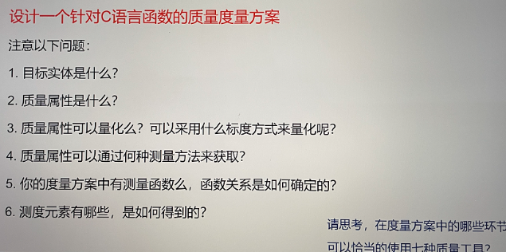
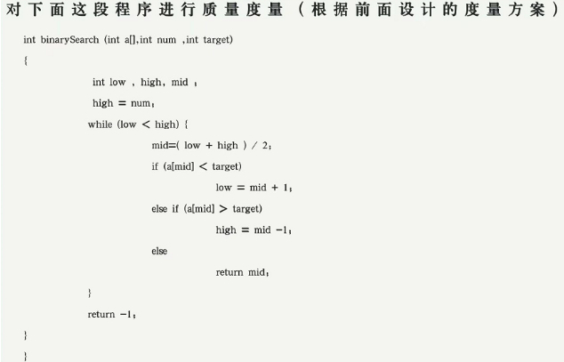

# 软件质量管理——作业
SY2206121 王一鸥

## 1.质量度量方案设计
### 1.1 目标实体
某C语言函数

### 1.2 质量属性
1）是否通过编译

2）代码缺陷行数

3）注释行数

4）测试用例通过数

### 1.3 质量属性的量化
1）“是否通过编译”属于标称标度，无法量化

2）“代码缺陷行数”属于比率标度，可以量化

3）“注释行数”属于比率标度，可以量化

4）“测试用例通过数”属于比率标度，可以量化

### 1.4 质量属性可以通过何种测量方式来获取
1）使用编译器对函数进行编译，看是否能够编译通过。

2）专家评审、计数。语义上属于同一类的缺陷，记为一个缺陷。

3）专家评审、计数。仅记录有效的注释行，空的或无意义的注释不算入内。

4）专家编写测试用例，在该函数上进行测试，记录通过的个数。

### 1.5 测量函数
1）无

2）缺陷代码行数/总代码行数

3）注释行数数/总代码行数

4）测试用例通过数/测试用例总数

### 1.6 测度元素
1）编译是否通过

2）代码缺陷率

3）代码注释率

4）测试用例通过率

## 2.针对如下C语言函数的质量度量

### 2.1 编译是否通过
在Ubuntu 20.04，gcc 9.4.0对该函数进行编译，编译不通过。

### 2.2 代码缺陷率
经过检查，该代码存在3处缺陷：

1）low变量没有初始化。该缺陷会导致函数执行完全失控。

2）while(low<high)的小于号，应为小于等于。该缺陷会导致在一些特殊的输入数据下，函数的输出不正确。

3）最后一行多了一个大括号

代码总行数16，缺陷数3，代码缺陷率为3/16

### 2.3 函数注释数
该函数没有注释，没有明确定义其行为，不利于函数的使用和维护，容易导致未来的软件质量问题。
代码注释率为0。

### 2.4 测试用例通过数
构造4个测试用例：

| a                     | num  | target | answer | output |
| --------------------- | ---- | ------ | ------ | ------ |
| {0,1,2,3,4,5,6,7,8,9} | 10   | 3      | 3      | -1     |
| {0,1,2,2,4,6,6,7,8,9} | 10   | 2      | 2      | -1     |
| {0,1}                 | 2    | 0      | 0      | -1     |
| {0,0,0,0,0}           | 5    | 2      | 0      | -1     |

其中a为数组，num为数组长度，target为要查询的数字，answer为正确答案，output为函数输出值。

四个测试用例全部错误，测试用例通过数为0。

其出错原因主要在于没有对low变量进行初始化。
